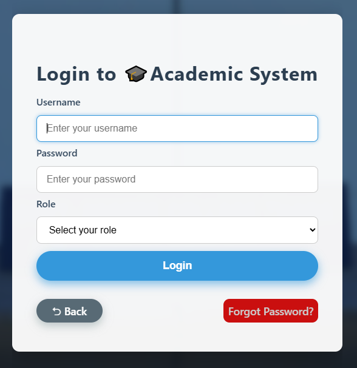
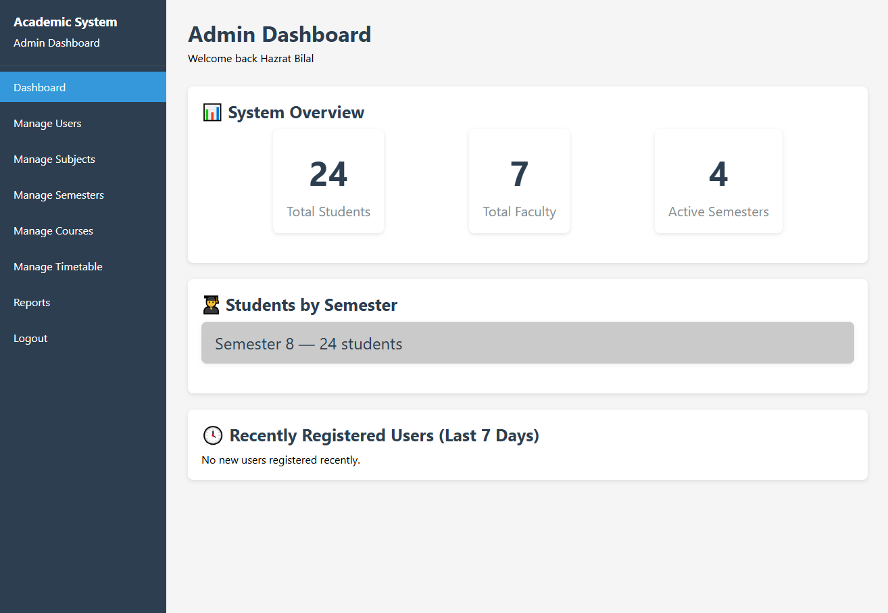
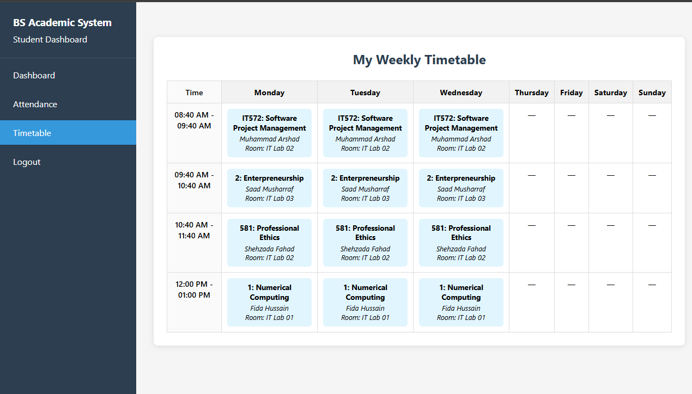

# 🎓 Academic Record Management System  

A **role-based academic management system** designed to simplify administration, teaching, and learning processes.  
This project provides a seamless experience for **Admins, Faculty, and Students** with tailored features for each role.  

---

## 🚀 Features  

### 👨‍💼 Admin  
- 🔑 Manage **Users** (Add / Edit / Delete)  
- 📚 Manage **Subjects**  
- 🗓️ Manage **Semesters**  
- 📖 Manage **Courses** (assign to faculty)  
- 🕒 Manage **Timetable**  

### 👨‍🏫 Faculty  
- 👀 View their assigned classes  
- 📋 Manage **Attendance** of assigned classes  
- 📂 Upload **Assignments** for their subjects  
- 📝 Create **Quizzes** in assigned subjects  
- 📢 Post **Announcements**  
- 📑 Upload **Study Materials**  

### 🎓 Students  
- 📢 View **Announcements**  
- 📑 Access and download **Study Materials**  
- 🗓️ View **Attendance**  
- 📥 Download **Assignments**  
- 📝 View **Quizzes** created by faculty  

---

## 🖼️ Screenshots  

👉 Add your screenshots in this section for better visualization.  

| Login Page | Dashboard | Timetable |  
|------------|-----------|-----------|  
|  |  |  |  

---

## 🛠️ Tech Stack  

- **Frontend:** HTML, CSS, JavaScript (Bootstrap / Tailwind)  
- **Backend:** PHP  
- **Database:** MySQL  
- **Version Control:** Git & GitHub  

---

## ⚙️ Installation & Setup  

1. Clone the repository  
   ```bash
   git clone https://github.com/your-username/academic-record-management.git
   cd academic-record-management
